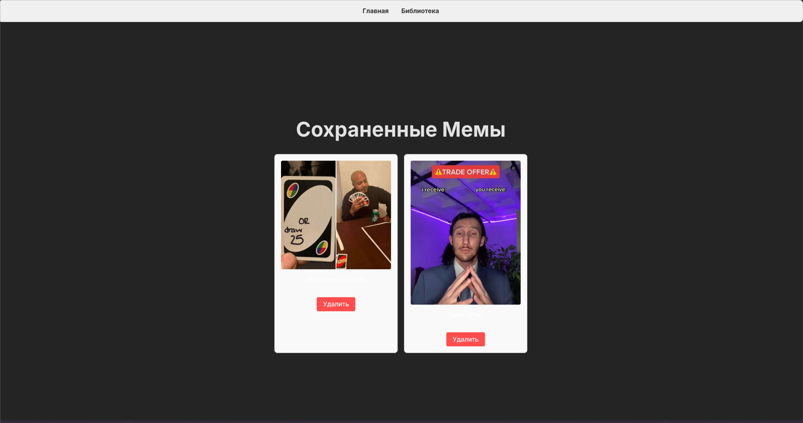

# Генератор Мемов

Это веб-приложение для генерации, сохранения и просмотра мемов, созданное в рамках курсовой работы. Оно представляет собой полноценное full-stack приложение с фронтендом на React и бэкендом на Node.js с использованием Express.

## ✨ Функционал

- **Генерация мемов**: Получение случайного мема из внешнего API (Imgflip API).
- **Сохранение мемов**: Возможность сохранить понравившийся мем в локальную базу данных (JSON-файл).
- **Библиотека мемов**: Отдельная страница для просмотра всех сохраненных мемов.
- **Удаление мемов**: Возможность удалить мем из своей библиотеки.
- **Адаптивный интерфейс**: Полностью русскоязычный интерфейс.




---

## 🚀 Технологический стек

- **Фронтенд**:
  - React
  - TypeScript
  - Vite
  - React Router DOM
- **Бэкенд**:
  - Node.js
  - Express.js
  - TypeScript
- **Инструменты**:
  - ESLint
  - Nodemon
  - Concurrently

---

## ⚙️ Установка и запуск

1.  **Клонируйте репозиторий:**

    ```bash
    git clone https://github.com/nemolucky/MemeGenerator
    cd <папка проекта>
    ```

2.  **Установите зависимости:**

    ```bash
    npm install
    ```

3.  **Запустите проект в режиме разработки:**
    - Эта команда одновременно запустит и бэкенд, и фронтенд.
    ```bash
    npm run dev
    ```
    Приложение будет доступно по адресу `http://localhost:5173`.

## 📜 Доступные скрипты

- `npm run dev`: Запускает и клиент, и сервер в режиме разработки с автоматическим обновлением.
- `npm run client:dev`: Запускает только клиент (фронтенд).
- `npm run server:dev`: Запускает только сервер (бэкенд).
- `npm run client:build`: Собирает фронтенд для продакшена в папку `dist`.
- `npm start`: Запускает собранное приложение в продакшен-режиме. (Требует предварительной сборки клиента).
